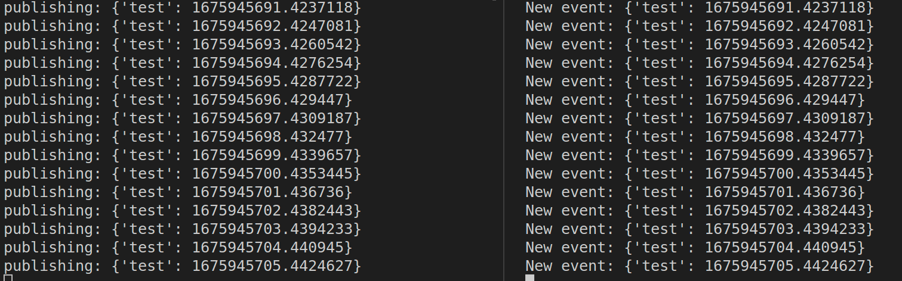
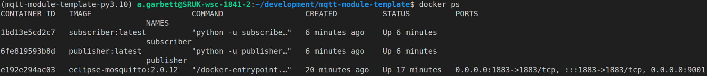

# Whisper Voice Assistant
A demo project for creating an AI voice assistant using [OpenAI Whisper](https://github.com/openai/whisper) on-device Automatic Speech Recognition, [Picovoice Porcupine](https://github.com/Picovoice/porcupine) Wake Word detection, and [Picovoice Cobra](https://github.com/Picovoice/cobra) Voice Activity Detection.

The script will load the Whisper model then you can use your wake word i.e. "Hey Google" and speak your query. Once you've stopped speaking the Voice Activity Detector will detect no speech and fire off the audio sample to Whisper to predict the text from the audio.

You can perform multiple wake-word operations one after another to detect the text in the audio stream.

# Setup
This project uses [Poetry](https://python-poetry.org/) for dependency management so you can easily get up and running by performing the following commands:

```
poetry shell
poetry install
```

# .env
Create a `.env` file in the root directory that will store your `ACCESS_KEY`, `WAKE_WORD_MODEL_PATH`, `WHISPER_MODEL`, and `VAD_SENSITIVITY` for using this script. See `.env.example` for the file structure.

## Picovoice Access Key
Create an account on the [Picovoice Console](https://console.picovoice.ai/) and create an `access key`. Once you have this access key add the access key to your `.env` file in the root directory.

## Train wake word
Use the Picovoice console to [train your own Porcupine wake word](https://console.picovoice.ai/ppn) by downloading the custom wake word file (`.ppn`) for the platform you are targeting (Linux, Mac OS etc).

Once you have downloaded your wake-word `.zip`, unzip the file and move the `.ppn` file to the `models` folder 

## OpenAI Whisper Model
You can select different models for performing the Automatic Speech Recognition by setting the `WHISPER_MODEL` key in the `.env` file. (e.g. `WHISPER_MODEL=tiny.en`).

Available models are:
|  Size  | Parameters | English-only model | Multilingual model | Required VRAM | Relative speed |
|:------:|:----------:|:------------------:|:------------------:|:-------------:|:--------------:|
|  tiny  |    39 M    |     `tiny.en`      |       `tiny`       |     ~1 GB     |      ~32x      |
|  base  |    74 M    |     `base.en`      |       `base`       |     ~1 GB     |      ~16x      |
| small  |   244 M    |     `small.en`     |      `small`       |     ~2 GB     |      ~6x       |
| medium |   769 M    |    `medium.en`     |      `medium`      |     ~5 GB     |      ~2x       |
| large  |   1550 M   |        N/A         |      `large`       |    ~10 GB     |       1x       |

## Open AI Whisper initial_prompt
Whisper can accept `initial_prompt` that will allow up to 1024 words to be used as a prompt to the model for context. The context you might want to provide is for jargon that you expect in the voice command i.e. "WebRTC SDP packets" etc.

You can set this by setting `WHISPER_INITIAL_PROMPT` and passing a string of words (up to 1024 words) in the `.env` file.

## VAD sensitivity
The [Cobra Voice Activity Detector](https://github.com/Picovoice/cobra) provides a probability of speech occurring in each speech sample. This is a prediction from 0 - 1.0. The script uses the mean probability values over n samples as the threshold of detecting when someone finishes speaking so that it can stop recording audio and predict the text in the speech.

Altering this threshold (0: no speech - 1.0 confident speech detected) can be achieved by altering the `VAD_SENSITIVITY` value. I recommend you set this to `0.7` which seems to work in my case.

## Example .env file
 
The `.env` structure should have the following:
```
.env
ACCESS_KEY=[your key here]
WAKE_WORD_MODEL_PATH=models/[your model file name.ppn]
WHISPER_MODEL=tiny.en
WHISPER_INITIAL_PROMPT=WebRTC SDP Signalling
VAD_SENSITIVITY=0.7
```

# Usage
Running the script:

```
python main.py
```

# Example log output
```bash
python main.py
loading model
loading model finished
Detected wakeword
listening - samples: 512
listening - samples: 1024
listening - samples: 1536
listening - samples: 2048
listening - samples: 2560
listening - samples: 3072
listening - samples: 3584
listening - samples: 4096
listening - samples: 4608
listening - samples: 5120
listening - samples: 5632
listening - samples: 6144
listening - samples: 6656
listening - samples: 7168
listening - samples: 7680
listening - samples: 8192
listening - samples: 8704
listening - samples: 9216
listening - samples: 9728
listening - samples: 10240
listening - samples: 10752
listening - samples: 11264
listening - samples: 11776
listening - samples: 12288
listening - samples: 12800
listening - samples: 13312
listening - samples: 13824
listening - samples: 14336
listening - samples: 14848
listening - samples: 15360
listening - samples: 15872
listening - samples: 16384
listening - samples: 16896
listening - samples: 17408
listening - samples: 17920
listening - samples: 18432
listening - samples: 18944
listening - samples: 19456
listening - samples: 19968
listening - samples: 20480
listening - samples: 20992
listening - samples: 21504
listening - samples: 22016
listening - samples: 22528
listening - samples: 23040
listening - samples: 23552
listening - samples: 24064
listening - samples: 24576
listening - samples: 25088
listening - samples: 25600
listening - samples: 26112
listening - samples: 26624
listening - samples: 27136
listening - samples: 27648
listening - samples: 28160
listening - samples: 28672
listening - samples: 29184
listening - samples: 29696
listening - samples: 30208
listening - samples: 30720
listening - samples: 31232
listening - samples: 31744
listening - samples: 32256
listening - samples: 32768
listening - samples: 33280
listening - samples: 33792
listening - samples: 34304
listening - samples: 34816
listening - samples: 35328
listening - samples: 35840
listening - samples: 36352
listening - samples: 36864
listening - samples: 37376
listening - samples: 37888
listening - samples: 38400
listening - samples: 38912
listening - samples: 39424
listening - samples: 39936
listening - samples: 40448
listening - samples: 40960
listening - samples: 41472
listening - samples: 41984
listening - samples: 42496
listening - samples: 43008
listening - samples: 43520
listening - samples: 44032
listening - samples: 44544
listening - samples: 45056
listening - samples: 45568
listening - samples: 46080
listening - samples: 46592
listening - samples: 47104
listening - samples: 47616
listening - samples: 48128
What recipe should I cook?
```

# MQTT Module Template
Use this project as a template for creating modules for subscribing and publishing MQTT data.

The project uses a broker docker container `mqtt` that manages the subscribers and publishers to route data between containers.

There are three containers:
1. `mqtt` - The message broker to route messages between scripts.
2. `modules/whisper-voice-assistant/main.py` - Publishes SpeechEvent objects on the `new_event` topic.
3. `modules/subscriber/subscriber.py` - Subscribes to the `new_event` topic.



# Install
This project uses [poetry](https://python-poetry.org/). Create a new environment using:

```
poetry shell
poetry install
```

# Running
There are three components in this system:

1. MQTT broker docker container that facilitates message exchange between scripts using mqtt publish and subscribe
2. `modules/whisper-voice-assistant/main.py` that publishes speech detection events to the `new_event` topic over MQTT.
3. `modules/subscriber/subscriber.py` that subscribes to the `new_event` topic and prints the message that has been received.

You can either run them all together using the convenient `run.sh` that builds each `Dockerfile` in the modules directory and then runs `docker-compose up -d [container name]`

Otherwise you can run the `mqtt` container and independently run each of the scripts to publish/subscribe so you don't have to keep re-running the containers.

## Run.sh - run everything as a container
You can run the entire stack using a single `run.sh` by simply running `run.sh` the containers will create each container using the `Dockerfile` within each module directory and then run `docker-compose up -d` to start all the containers specified in the `docker-compose.yml`.

Running `run.sh` will create three containers:
1. `mqtt`
2. `whisper-voice-assistant`
3. `subscriber`

You can see the containers running using:

```
docker ps
```
Example:



## Individual containers or as scripts
If you're developing a module i.e. `modules/subscriber/subscriber.py` and you don't want to have to keep restarting the containers and running `run.sh` on every file change. You can *first run the mqtt broker container* and then independently run the script you're working on. This can be helpful if you w


Run the `docker-compose` file to start the mqtt broker using:

```
docker-compose up -d
```

This will start a broker service so that the `whisper-voice-assistant/main.py` and `subscriber/subscriber.py` can publish and subscribe to the `mqtt` service.

There are two modules `whisper-voice-assistant/main.py` and `subscriber.py`.

`whisper-voice-assistant/main.py` publishes on the topic `new_event` and sends a pickled dictionary in the format of:

```
{"test": 1675943452.2049432, "query": "This is something I said"}
```

`subscriber.py` subscribes to `new_event` and prints out the published event.

Open two terminals and run both `publisher.py` and `subscriber.py` using:

Terminal 1:
```
poetry shell
python publisher.py
```

Terminal 2:
```
poetry shell
python subscriber.py
```

You should now see two terminals like this:


## Event Data structures - best practice
To standardize how data is passed around the MQTT modules it's helpful to use a [Python dataclass](https://docs.python.org/3/library/dataclasses.html) that defines your data structure. This can help with clarifying the shape and properties of the objects you publish and subscribe to in the system.

You can see the event types in each of the `schema` folders in the module directories i.e. `modules/publisher/schemas/event.py`.

e.g.

```python
from dataclasses import dataclass

@dataclass
class Event:
  event: str
  time: float
```

Using this structure then means you can easily publish and subscribe to a known data structure and assist in module development when working with others.

i.e.

```python
# publisher.py
from schemas.event import Event
data = Event(event="test", time=time.time())
client.publish(EVENT_TOPIC, pickle.dumps(data))
```

```python
# subscriber.py
from schemas.event import Event
client.subscribe(EVENT_TOPIC)
def on_event(client, userdata, msg):
  """New event has been published"""
  data: Event = pickle.loads(msg.payload)
  print(f"New event: {data}")
```


## Helpful commands
A few helpful commands.

### Docker ps
Show the currently running containers.

```
docker ps
```

### Viewing docker container logs
View log output for a container.

```
docker logs --follow [container name i.e. publisher]
```

#### dtail - add to your .bashrc
It's helpful to create the `dtail [container name]` alias in your `.bashrc` file. It's an alasi for the `docker logs --follow [container name]` command, just easier!

```
.bashrc
alias dtail="docker logs -f --tail 100 $1"
```

Then you can use `dtail publisher` and easily see the continuous logs of the publisher container.